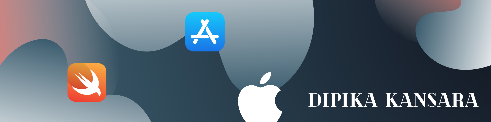

# SWAPI APP

## Description

Swift iOS app displaying Star Wars films using SWAPI, the Star Wars API

Built using XCode 11.6 (Swift 5.1)

#### System Requirements
iOS version 13.0+

## Technologies

* Networking with URLSession
* [SWAPI](https://swapi.dev), the open Star Wars API
* XCTest for unit tests

## Take-Home Challenge Requirements

#### Write an iOS app in Swift that lists Star Wars films using the open [API](https://swapi.dev) and targeted at iOS 13.0 +

This project follows the features a pure UIKit solution with views written programmatically and built with XIB files.

#### Additional

Unit tests were written using XCTest to test the networking calls with URLSession and to check that the word count string extension was returning the correct number of words in the `opening_crawl` attribute.

The app supports light/dark mode, landscape/portrait orientation and uses Dynamic Type.

